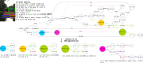

# CIC-BART-SSA: Controlled Image Captioning with Structured Semantic Augmentation

<center>

</center>

<em>Figure 1. Existing captioning datasets contain captions that describe the entirety of an image. This is reflected in the narrow distributions of both the entities that appear in those captions and the corresponding caption lengths (the red-colored histograms). CIC aims to generate diverse descriptions by controllably re-focusing on different spatiosemantic aspects of an image, such as the semantically coherent subsets of image objects. Our proposed CIC-BART-SSA is designed to produce diverse, controlled captions that can range from brief and concise to detailed and comprehensive. Sentences 1-15 are example outputs of our approach where the highlighted text indicates the focus of a controllable caption. The histograms demonstrate that our approach generates high-quality descriptions for a wider range of scene focus (number of visual entities) and caption length compared to the original captions. [Image](http://cocodataset.org/\#explore?id=108338) is licensed under a [Creative Commons CC BY-SA 2.0](https://creativecommons.org/licenses/by-sa/2.0/). </em>

## Structured Semantic Augmentation (SSA) Dataset Generation

<center>

</center>

<em>Figure 2. An example of our Structured Semantic Augmentation (SSA) approach. Visually-grounded captions (1)-(5) are used to create a meta-vgAMR graph, which includes all available image information in one representation. Sub-graphs of meta-vgAMR are then sampled to generate a new and diverse set of captions, such as the sentences (a)-(e). Our approach takes advantage of both linguistic and spatial diversity, with the latter creating descriptions for new combinations of visual entities. For instance, caption (a) focuses only on the 'boat', and captions (c) and (d) focus on the 'dock' and 'house', combinations that are not explored in the original captions. [Image](https://farm3.staticflickr.com/2129/2432734812\_f1d31a8726\_z.jpg) is licensed under a [Creative Commons CC BY-SA 2.0](https://creativecommons.org/licenses/by-sa/2.0/)</em>


### 1. Caption to AMR conversion
Convert captions to their AMR representations. The AMRs should include the alignment information of an AMR node with the corresponding word of the original phrase. In our current version we used the pretrained Text-to-AMR parser with alignment: https://github.com/IBM/transition-amr-parser. Example datasets with entity visual grounding information are 1) [MSCOCO Entities](https://github.com/aimagelab/show-control-and-tell) and 2) [Flickr-30k Entities](https://github.com/BryanPlummer/flickr30k_entities).

### 2. Event-focused vgAMRs Generation
Visually ground the caption AMR nodes to the corresponding image entities, to derive the vgAMRs of each image--caption pair of the dataset. Merge to a single meta-vgAMR all individual caption vgAMRs of each image. Sample event-focused vgAMRs from the global meta-vgAMR structure. For MSCOCO Entities Dataset:
```
cd ssa-coco
python ssa.py
```
and for Flickr-30K Entities:
```
cd ssa-flickr
python ssa.py
```
### 3. SSA dataset for downstream tasks
Using the event-focused sampled vgAMRs and an AMR-to-Text parser, convert the graph representations to event-focused captions. In our pipeline we used [SPRING AMR-to-Text](https://github.com/SapienzaNLP/spring) model which we trained from scratch on a dataset composed of AMR2.0, plus the training [MSCOCO](https://cocodataset.org/) captions paired with their (automatically-generated) AMRs.

For each generated sentence we compute their [GRUEN](https://github.com/WanzhengZhu/GRUEN) score. We filter out the sentences with poor text quality, having a GRUEN score less than a pre-defined threshold (t=0.7).

Finally, we save the SSA event-focused captions along with their visual grounding information so we can use them for downstream applications. We follow a similar to [ASG json format](https://github.com/cshizhe/asg2cap):
```
JSON Format:
{
	"region_id": {
		"objects":[
			{
	     		"object_id": int, 
	     		"name": str, 
	     		"attributes": [str],
				"xmin": int,
				"ymin": int, 
				"xmax": int, 
				"ymax": int
			}],
  	  "relationships": [
			{
				"relationship_id": int,
				"subject_id": int,
				"object_id": int,
				"name": str
			}],
  	  "phrase": str,
  }
}
```
To generate the SSA augmentations for MSCOCO Entities use:
```
cd ssa-coco
python dssa-generation.py
```
and for Flickr-30k Entities:
```
cd ssa-flickr
python dssa-generation.py
```

## CIC-BART-SSA model for Controllable Image Captioning
### 1. Set up

#### 1.1 Stanford Tagger
For Stanford Tagger use the installation instructions from [here](https://www.nltk.org/api/nltk.tag.stanford.html). Track the location of the downloaded `english-bidirectional-distsim.tagger` and `stanford-postagger.jar` files, and use them for the `--spos_model` and `--spos_jar` CIC-BART-SSA parameters.

#### 1.2 Precomputed image feature vectors
For preparing the precomputed image feature vectors first set-up Detectron2 (README file in `cic-bart-ssa\feature_extraction`) and then run for:
1. MSCOCO Entities dataset images:
```
cd cic-bart-ssa\feature_extraction
python coco_gtboxes_cic-bart-ssa.py --cocoroot <MSCOCO Entities images folder> --coco_entities <MSCOCO Entities dataset>
```
2. Flickr-30k Entities dataset images:
```
cd cic-bart-ssa\feature_extraction
python flickr30k_gtbboxes-cic-bart-ssa --flickrroot <Flickr-30k Entities images folder> --entities_annotations <Flickr-30k Entities dataset 'Annotations' folder> --entities_sentences <Flickr-30k Entities dataset 'Sentences' folder>
```
Use the precomputed features h5 files for the `--precomp_features` parameter of CIC-BART-SSA.

#### 1.3 GloVe vectors
You can download GloVe vectors from [here](https://nlp.stanford.edu/projects/glove/). For `--glove_vectors` use the path of `glove.6B.300d.txt` file.

#### 1.4 Visual Genome vocabulary files
Download the Visual Genome objects and attributes vocabulary from [here](https://github.com/peteanderson80/bottom-up-attention/tree/master/data/genome/1600-400-20). Add their location to `--vg_objects_name`, `--vg_attrs_name`.

### 2. Training
For training our CIC model you can use the scripts:
1. For MSCOCO Entities and their SSA augmentations
```
cic-bart-ssa\scripts\cic-bart-coco.sh
```
2. For Flickr-30k Entities and their SSA augmentations
```
cic-bart-ssa\scripts\cic-bart-flickr.sh
```

## Acknowledgements
Parts of our codebase are taken or adapted from the following repositories:
* [VL-T5](https://github.com/j-min/VL-T5)
* [Detectron2](https://github.com/facebookresearch/detectron2)
* [Show Control & Tell](https://github.com/aimagelab/show-control-and-tell)
* [ASG2Cap](https://github.com/cshizhe/asg2cap)
* [Transition AMR Parser](https://github.com/IBM/transition-amr-parser)
* [SPRING](https://github.com/SapienzaNLP/spring)